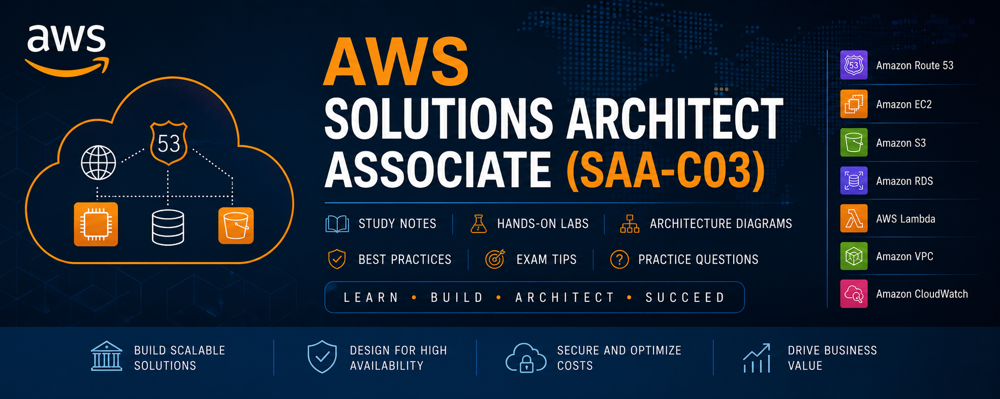

  

# ☁️ AWS Certified Solutions Architect -- Associate (SAA-C03) Study Notes

Welcome to my AWS Solutions Architect Associate (SAA-C03) study
repository!

This repository contains my personal study notes, diagrams, practice
questions, and hands-on learning as I prepare for the **AWS Certified
Solutions Architect -- Associate (SAA-C03)** certification.

## 📚 Topics Covered

### Compute

-   Amazon EC2
-   Auto Scaling
-   Elastic Load Balancer (ELB)
-   AWS Lambda
-   Amazon ECS
-   Amazon EKS
-   AWS Elastic Beanstalk

### Storage

-   Amazon S3
-   Amazon EBS
-   Amazon EFS
-   AWS Storage Gateway
-   AWS Backup

### Networking & Content Delivery

-   Amazon VPC
-   Amazon Route 53
-   Amazon CloudFront

### Security & Identity

-   AWS IAM
-   AWS KMS
-   AWS Secrets Manager
-   AWS WAF

### Monitoring

-   Amazon CloudWatch
-   AWS CloudTrail
-   AWS Config

## 🎯 Learning Objectives

-   Build a strong understanding of AWS services.
-   Prepare for the AWS Certified Solutions Architect -- Associate
    (SAA-C03) exam.
-   Share concise notes and hands-on learning with the community.

## 📜 License

MIT License.
